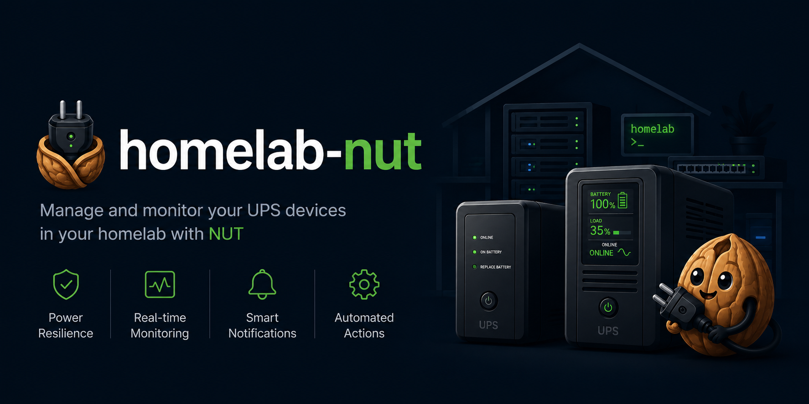

# Homelab NUT (Network UPS Tools)

This repository contains documentation and configuration examples for setting up Network UPS Tools (NUT) in a homelab environment. NUT provides a common protocol and set of tools to monitor and manage UPS (Uninterruptible Power Supply) hardware.

## Overview

NUT allows you to:
- Monitor UPS status (battery level, load, input/output voltage, etc.)
- Execute actions on power events (shutdown systems gracefully on low battery)
- Share UPS status across multiple machines on your network
- Support for 100+ different UPS manufacturers

## Architecture

```
┌─────────────────┐     ┌─────────────────┐     ┌─────────────────┐
│   UPS Device    │────▶│   NUT Server    │────▶│   NUT Client    │
│  (USB/Serial)   │     │  (nut-server)   │     │   (nut-client)  │
└─────────────────┘     └─────────────────┘     └─────────────────┘
                              │                        │
                              │                        │
                        Monitors UPS            Receives status
                        Shares data             Triggers shutdown
```

## Documentation

| Document | Description |
|----------|-------------|
| [Server Setup](docs/server-setup.md) | How to install and configure NUT server |
| [Client Setup](docs/client-setup.md) | How to configure NUT clients to monitor remote UPS |
| [CLI Reference](docs/cli-reference.md) | NUT command-line tools and usage |
| [Docker Setup](docs/docker-setup.md) | Run NUT in Docker with web UI and monitoring |
| [Notifications](docs/notifications.md) | Slack, Discord, Pushover, Telegram alerts |
| [Smart Shutdown](docs/smart-shutdown.md) | Shutdown UniFi, LG TVs, NAS via Home Assistant |

### Prometheus exporter, two ways

The Prometheus exporter (`druggeri/nut_exporter`) can run either inside the
Docker stack (Option 2 below) or as a bare-metal systemd service (Option 4).
Both expose the same metrics on the same port — pick whichever fits the host:

- **Docker** when the host already runs Docker / Compose for other services.
- **Bare-metal** for low-resource hosts where Docker overhead matters
  (Pi Zero, Pi Zero 2 W, OpenWrt boxes, etc.).

## Quick Start

### Option 1: Automated Setup Scripts

```bash
# Server setup (Debian/Ubuntu)
sudo ./scripts/setup-server.sh myups usbhid-ups

# Client setup (provide server IP, UPS name, password from server setup)
sudo ./scripts/setup-client.sh 192.168.1.10 myups secretpassword

# Check status (auto-discovers the local UPS; or pass UPS@HOST explicitly)
./ups-status.sh

# View credentials stored by setup-server.sh
./scripts/show-credentials.sh
# or directly:
sudo cat /root/nut-credentials.txt

# Trigger a UPS battery self-test (must run on the host the UPS is attached to)
./scripts/test-battery.sh           # quick test (default)
./scripts/test-battery.sh --deep    # deep test
./scripts/test-battery.sh --status  # show last test result
./scripts/test-battery.sh --list    # list supported test commands
```

### Option 2: Docker monitoring on top of bare-metal NUT

The Docker stack runs **alongside** a bare-metal `nut-server` (it does not
run its own copy of `nut-server` to avoid USB/port conflicts). Two services:

- `nut-exporter` — Prometheus metrics endpoint (scrape from a remote Prometheus)
- `nut-webgui` — web UI for the UPS

Prometheus and Grafana are intentionally not included — host them elsewhere
and point them at this host's `nut-exporter`.

Set up bare-metal NUT first with `setup-server.sh`, then:

```bash
cd docker
cp .env.example .env
# Edit .env: set NUT_HOST and UPS_NAME for the nut-exporter

# Configure nut-webgui for one or more NUT servers (see nut-webgui.toml)
# The file is pre-configured; edit addresses/ports if your setup differs.
docker compose up -d
```

The webgui supports multiple NUT servers via `docker/nut-webgui.toml` — add a
`[upsd.<name>]` section for each host running `nut-server`.

Access:
- **Web UI** (nut-webgui): http://localhost:9000
- **Prometheus exporter**: http://localhost:9199/ups_metrics

### Option 3: Bare-metal Prometheus exporter (no Docker)

For low-resource hosts (Pi Zero, Pi Zero 2 W) where Docker is overkill, install
the same `druggeri/nut_exporter` binary as a systemd service:

```bash
# Defaults: scrape localhost, no auth, listen on :9199
sudo ./scripts/setup-exporter.sh

# Remote NUT server with auth (use the upsmon_remote password from
# /root/nut-credentials.txt on the NUT server)
sudo ./scripts/setup-exporter.sh 192.168.1.10 upsmon_remote <password>
```

The script auto-detects architecture (`amd64`, `arm64`, `arm`, `386`) and pulls
the latest release from GitHub. Pin a version with `NUT_EXPORTER_VERSION=v3.2.5`
or change the listen port with `NUT_EXPORTER_PORT=9199`.

Credentials live in `/etc/default/nut-exporter` (mode 0640) and the service
runs as a dedicated unprivileged `nut-exporter` user under hardened systemd
sandboxing (`ProtectSystem=strict`, `NoNewPrivileges`, etc.).

To check status from any machine without installing NUT or `upsc`:

```bash
./scripts/exporter-status.sh http://192.0.2.10:9199 myups
./scripts/exporter-status.sh http://192.0.2.10:9199 myups --json   # machine-readable
./scripts/exporter-status.sh http://192.0.2.10:9199 myups --raw    # all metrics
```

### Option 4: Remote Shutdown Service

Automatically SSH into a remote node and run `~/shutdown.sh` when the UPS battery drops below a threshold. Managed by `ups-service.sh` on the NUT server (Pi).

```bash
# First run — interactive setup wizard (SSH keys, remote node, threshold)
sudo ./scripts/ups-service.sh

# Subsequent runs — management menu
sudo ./scripts/ups-service.sh

# Or use subcommands directly
sudo ./scripts/ups-service.sh status
sudo ./scripts/ups-service.sh set-threshold 40
sudo ./scripts/ups-service.sh logs
sudo ./scripts/ups-service.sh remove
```

Config is written to `config/ups-battery-shutdown.<hostname>.conf` in the repo and symlinked to `/etc/ups-battery-shutdown.conf`. Multiple NUT servers can share the same repo — each gets its own config file scoped by hostname.

### Option 5: Manual Server Setup

```bash
# Install NUT
sudo apt install nut

# Configure UPS driver, server, and users
sudo nano /etc/nut/ups.conf
sudo nano /etc/nut/upsd.conf
sudo nano /etc/nut/upsd.users

# Start services
sudo systemctl enable nut-server
sudo systemctl start nut-server
```

### Option 6: Manual Client Setup (remote machines)

```bash
# Install NUT client
sudo apt install nut-client

# Configure connection to server
sudo nano /etc/nut/nut.conf
sudo nano /etc/nut/upsmon.conf

# Start monitoring
sudo systemctl enable nut-client
sudo systemctl start nut-client
```

## Supported Platforms

- Debian / Ubuntu
- RHEL / CentOS / Fedora
- Proxmox VE
- TrueNAS
- Docker

## Project Structure

```
homelab-nut/
├── README.md
├── ups-status.sh                        # Pretty-printed UPS status (run on the Pi)
├── upsc-output.md                       # upsc variable reference (APC Back-UPS ES 650G1)
├── docs/
│   ├── server-setup.md      # Server installation guide
│   ├── client-setup.md      # Client configuration guide
│   ├── cli-reference.md     # NUT CLI commands
│   ├── docker-setup.md      # Docker deployment guide
│   ├── notifications.md     # Alert configuration
│   └── smart-shutdown.md    # Device shutdown automation
├── docker/
│   ├── compose.yml                   # nut-webgui + Prometheus exporter
│   ├── nut-webgui.toml               # Multi-server webgui config (tracked)
│   ├── nut-webgui.toml.example       # Template for nut-webgui.toml
│   └── .env.example                  # Environment template
├── config/
│   └── ups-battery-shutdown.<hostname>.conf   # Per-server remote shutdown config
├── reference/
│   ├── grafana/             # Grafana provisioning config (datasource + dashboard)
│   └── prometheus/          # Prometheus scrape config
└── scripts/
    ├── setup-server.sh        # Automated NUT server setup
    ├── setup-client.sh        # Automated NUT client setup
    ├── setup-exporter.sh      # Bare-metal nut_exporter (no Docker)
    ├── exporter-status.sh     # Status check via nut_exporter HTTP
    ├── test-battery.sh        # Trigger UPS battery self-test (localhost only)
    ├── show-credentials.sh    # Print /root/nut-credentials.txt via sudo
    ├── ups-service.sh         # Remote shutdown service manager (setup + menu)
    └── services/
        └── battery-shutdown.sh   # Daemon — installed by ups-service.sh, not run directly
```

## Resources

- [NUT Official Documentation](https://networkupstools.org/docs/user-manual.chunked/index.html)
- [NUT Hardware Compatibility List](https://networkupstools.org/stable-hcl.html)
- [NUT GitHub Repository](https://github.com/networkupstools/nut)
- [nut-webgui (web UI used by the Docker stack)](https://github.com/SuperioOne/nut_webgui)
- [druggeri/nut_exporter (Prometheus exporter)](https://github.com/DRuggeri/nut_exporter)

## License

MIT
